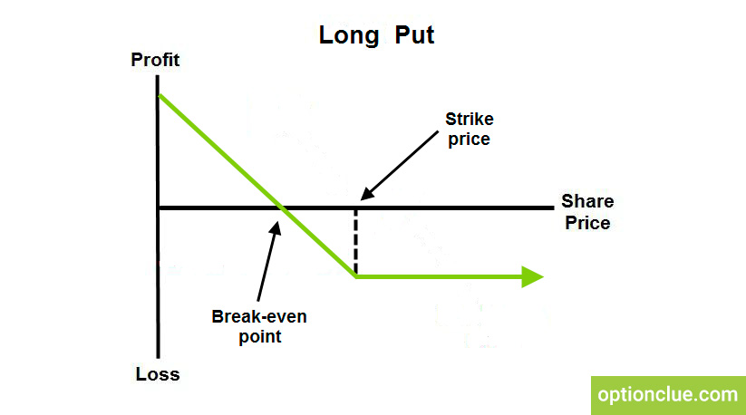

# Option Profit Calculator
Option Profit Calculator originally designed for HooHacks 2024. Legacy version powered by Streamlit with data sourced from Alpha Vantage Stock API. Created by Michael Martinez and Alex Zhou from William &amp; Mary and David Hu from the University of Virginia.

Current version powered by PyQt5 with data sourced from the Schwab Developer API. Currently maintained by Michael Martinez. 

## Background

Options are financial products that serve as a contract, giving the holder the right, but not the obligation, to buy or sell an asset at an agreed price before the contract's expiration date. Options come in two flavors, either as "calls" or "puts". Buying a "call" option gives you the right to buy the agreed asset at its strike price, also known as $K$. You might do this if you feel the stock will meet or exceed $K$. Buying a "put" option gives you the right to _short sell_ the agreed asset at $K$. You might do this if you feel the stock will fall past $K$. It's important to note, entering an option trade gives you control over 100 shares of the underlying stock (for a call, right to buy 100 shares, for a put, right to sell 100 shares). This gives traders tremendous leverage and can yield very high profits or losses for relatively little cost. 

__Why are options useful?__ The raw definition is a little esoteric, so an example might be a bit more instructive.  Let's say you have a friend at Apple, and they told you (and only you) on Monday that they're about to release a brand new iPhone on Wednesday. You are certain the stock will go up, so you decide to enter a trade (this is also called insider trading, and it is a horrible idea if you don't want the SEC to ruin your life!). Apple's current stock is $250, but you know that their price will increase past $260 before the end of the week. You could buy 100 shares, but that would cost you $2500! Instead, you look at your broker, and see that a call option at $K$=$260 expiring this Friday costs only $15. You know that the stock will go past that price by Friday, so you buy it with no worries. Lo and behold by the end of the week the stock is at $275. The call option is a contract that _guarantees_ that as long as the stock went past $K$=$260, you can buy the stock for the low price of $260, even if it's at $275. So, you get a $15 discount ($275 - $260) per share, which you can pocket as profit. Now recall that each option contract controls 100 shares. So multiply this discount by the number of shares, $15 \times 100 = 1500$. We only paid $15 upfront, meaning our total profit was $1475. This is a __9733.3%__ ROI, which is astronomical by any standards. 

Of course, this is too good to be true. You probably don't have a friend at Apple to give you insider info (and even if you did, you shouldn't trade on that information). Yet even if you did have no moral issues with insider trading, options are riskier than they seem. Let's say everything from the previous example holds, but the stock only rises to $259 by Friday based on the new announcement. Then, the call option is worthless, because the stock price $S$ is less than $K$. You've lost $15. What if the announcement is delayed until next Wednesday? Remember, your call option is only valid until this Friday, meaning it _expires_ Friday. Apple stock will not rise by then, and you've lost $15. To profit with options, we don't need to just be right about the _direction_ the stock will go in &ndash; we also need to be right about the _magnitude_ and the _timing_. 

All of this price action can be visualized with plots. Notice the plot for a long call strategy (buying a call): 


Sourced from [optionclue](https://optionclue.com/en/tradinglossary/long-call/)

Going back to our previous example, the "Strike price" points to $260. Notice that before that, the option graph is constant. For our example, this would be constant at -$15, the premium you paid for the option. After that, the value of the contract increases 1:1 with the price of the stock. Notice there's a break-even point _after_ the strike price, where profit is 0. Intuitively, this means your underlying stock not only needs to make it past $K$, but the stock price needs to inrease enough to offset the upfront cost of the option. The breakeven point is $S$=$260.15 for our previous example. 

The plot for a long put strategy is similar (buying a put):


Sourced from [optionclue](https://optionclue.com/en/tradinglossary/long-put/)

Notice in the put graph, we profit if the stock price _falls below_ $K$, and we lose the initial investment otherwise. You might do this if your friend told you on Monday that Apple's whole executive board was going to resign on Wednesday, so you guessed the stock would drop. 

We've only been talking about buying options so far, but you can also be the seller in the option transaction as well. What does it look like when you sell (or "short") an option? The plots are instructive: 


Sourced from [optionclue](https://optionclue.com/en/tradinglossary/short-call/)

Sourced from [optionclue](https://optionclue.com/en/tradinglossary/short-put/)

Instead of paying a premium up front we _receive_ a premium up front. But notice if the stock rises (or falls) past $K$, we lose... and we keep losing proportionally to how far the stock goes! This type of strategy is called a "Naked Call" (or a "Naked Put"), and is sometimes compared to picking up pennies in front of a steamroller. You can get nice premiums over time if you sell them many times over, but one bad event can really wreck your whole savings. naked strategies are banned on many brokerages because of the enormous losses it can wreck on ignorant day traders. Short calls (or puts) are rarely used on their own, but they are an important piece of more advanced strategies that I won't detail here, and are often deployed very profitably by hedge funds.  

## Motivation for the Strategy Payoff Diagram

We can build more advanced strategies with unique properties by combining multiple options. An example is a "straddle", which you can make by buying a call and a put at the same $K$:


Sourced from [optionclue](https://optionclue.com/en/tradinglossary/long-straddle/)

This strategy profits off of very large moves in the underlying asset, regardless of the direction. As an example, say NVIDIA earnings are coming up and you have no idea if they will be good or bad, but you suspect that either way, the stock is going to move a lot. No matter what happens, you'll stand to make a profit &ndash; unless the stock doesn't move at all, in which case _both_ options would be worthless, and you lose twice as much money! 

The first part of the Option Profit Calculator, the "Strategy Payoff Diagram" aims to help traders make these types of strategies on their own by letting them view different options from the same stock, add them together, and create diagrams similar to above. That way, they can create custom strategies, view where they might profit, and note their total cost.

## Motivation for the Future Payoff Table

In our discussion about options, we haven't yet talked about how the option premium is determined and what it means. For example, how was the $15 premium (or value) of the call in the first example determined? On the trading floor, options are priced like any other commodity: the value fluctuates until the quantity that sellers are willing to sell equals the quantity that consumers want to buy. However, thanks to the work of some very bright applied mathematicians, we have some neat mathematical models that can approximate this market equilibrium value. 


### European options


- __Black-Sholes Model__: For a call ($C$) and put ($P$), the premiums can be given by:  

$$
C = S_0 \Phi(d_1) - K e^{-rT} \Phi(d_2)
$$

$$
P = K e^{-rT} \Phi(-d_2) - S_0 \Phi(-d_1)
$$

where

$$
d_1 = \frac{\ln\left(\frac{S_0}{K}\right) + \left(r + \frac{\sigma^2}{2}\right)T}{\sigma \sqrt{T}}
$$

and

$$
d_2 = d_1 - \sigma \sqrt{T}
$$

- \( $C$ \) = Price of the call option
- \( $S_0$ \) = Current price of the underlying asset
- \( $K$ \) = Strike price of the option
- \( $r$ \) = Risk-free interest rate
- \( $T$ \) = Time to expiration (in years)
- \( $\sigma$ \) = Volatility of the underlying asset
- \( $\Phi$ \) = Cumulative distribution function of the standard normal distribution

The formula seems quite intimidating, but there's a fairly simple interpretation of it. Ignoring the $e^{-rt}$ and $\Phi$ terms, we have $C=S_0 - K$ and $P=K-S_0$. This is just the absolute difference between the final stock price and the strike price, which is just the profit of a call or a put. The $\Phi$ term is just a way of getting the normally distributed probability of reaching either $S_0$ or $K$. The $e^{-rt}$ term is just a discounting factor to get present values from future values based on the current risk-free interest rate (in practice, U.S. treasury rates). So all in all, the formula is the __expected value__ of the underlying asset's price at expiration, adjusted by a certain probability, minus the __present value__ of $K$, adjusted by a certain probability, which in theory yields the optimal valuation of the option. 

### American options

European options yield nice closed-form formulas, but American options pose a challenge for mathematical modeling. With European options, you are not allowed to exercise (buy/sell the underlying asset at the agreed price, $K$), until _the day of the expiration date_. In American options, you _are_ allowed to, meaning that we have to check if at any point in time you could yield a better profit by buying/selling the underlying asset rather than just holding the option. There is no closed-form solution for this, but we do have approximations: 

- __Binomial/Trinomial Option Pricing Model__: We won't go into the details of this method here, but this essentially amounts to a monte carlo simulation, checking if at any point in time it is optimal to exercise early rather than just hold the option to expiration. This is then added to the premium, and the premium increases. 
- __Bjerksund-Stensland Model__: A closed-form approximation of the Binomial/Trinomial Model detailed in 1993 and [revised in 2002](https://derivativesacademy.com/storage/uploads/files/modules/resources/1703192811_bjerksund_stensland_2002_closed_form_valuation_of_american_options.pdf). It is slightly less accurate, but it is much faster to compute and takes in the same parameters as the Black-Sholes model ($C, S_0, K, r, T, \sigma$).

With the American models, we can actually price what the option's value might be in the market between now and the option's expiration, and under different market conditions. This is what the Option Profit Calculator does with the "Future Payoff Diagram", using the [optlib](https://github.com/dbrojas/optlib/tree/master) library. Here's an example: 


Displayed here are the different values of an Apple call option, $K$=$257.5 expiring on 12/20/2024 at a range of different prices (currently ~$253 as of 12/17/2024). The user is able to toggle between value and profit, where profit will just be the value minus the total cost of the options. The heatmap works for multiple options grouped together, calculating possible value over time for custom strategies. Of course, this assumes that all six parameters stay constant over this time period, which is an enormous assumption. The sensitivity of the option's value to stock price, volatility, time, and other parameters can be calculated using derivatives, which yield the __Option Greeks__. Interpreting them is beyond the scope of this introduction, but a good overview can be found [here](https://www.youtube.com/watch?v=kCJcEOYuuII&ab_channel=OptionAlpha).


## Running the App

To run the app, first clone the repository:
```
git clone https://github.com/mikemartinez13/option-profit-calculator.git
```
Next, create a conda environment with the necessary packages using the `options_proj.yml` file: 
```
conda env create --name options-proj --file=options_proj.yml
```
If you use pip, you can use: 
```
pip install -r requirements.txt
```
Make sure that you have an account setup with [Schwab Developer](https://developer.schwab.com/login). Full instructions for setting up an account can be found in the `project-writeup/writeup.pdf` file. Video instructions can be found on [Tyler Bowers' YouTube](https://www.youtube.com/watch?v=kHbom0KIJwc&ab_channel=TylerBowers). If you do not have a Schwab Developer account, you may still run the app in `demo` mode.

To run the app without Schwab Developer, run:
```
python main.py --demo
```
In your command line. This will open a demo of the app with restricted functionalities using only Apple options data from 11/22/2024.

## Using Schwab Developer

Once you have an active Schwab Developer account and have created an app, open the "Apps Dashboard" in the Schwab Developer Portal. Under your app, press "View Details". In your App Details, copy your App Key and Secret to your clipboard. This will be used to access the API. 
In your `option-profit-calculator` directory, create a file named `.env`, and format it like so: 
```
APP_KEY=<Your App Key>
SECRET_KEY=<Your Secret>
```
Now the program will be able to access your keys and query data from Schwab API. These keys are akin to passwords and __should be kept in a safe location, especially if your Schwab Developer account is connected to your trading account__. The Option Profit Calculator will not store your keys or expose them in any way. 

Once your `.env` file is set up, simply run:
```
python main.py
```
In the command line. The first time you run this, Schwab may ask you to sign in and approve connection to your trading account. This window may appear: 


Here, you will log in with your Charles Schwab trading account, not Schwab Developer. To update authorization, check all agreements and approve linking to your Charles Schwab account. Once you have done that, you will be taken to a screen like this: 


Click on the top URL in this window and paste it into the command line where you are running the application, where it reads "After authorizing, paste the address bar url here:"

Once you've done that, the app will open after a few seconds and be ready to query data!
